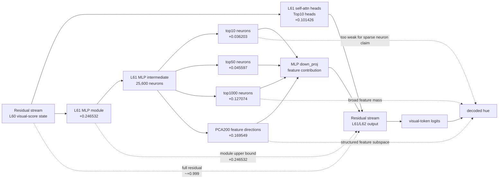
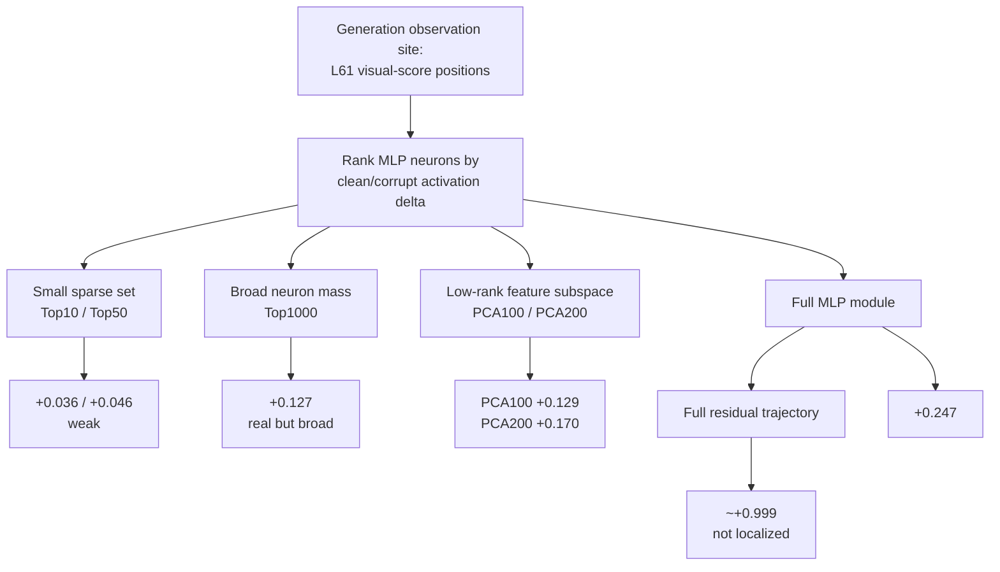
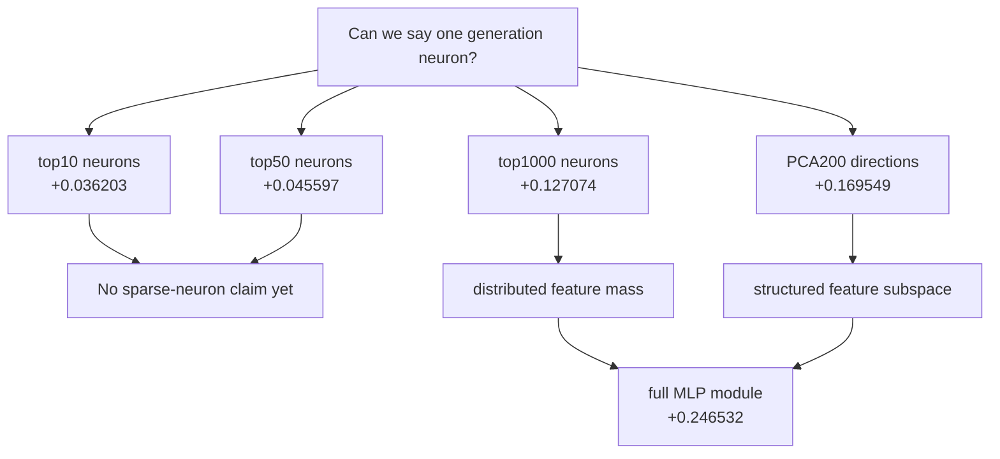
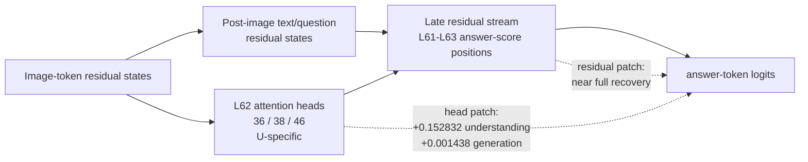
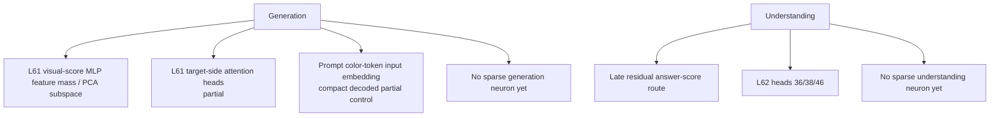

# Emu3.5 Neuron / Feature Activation Path Visualization

## 1. What Counts As A Neuron Path Here

In this investigation, an MLP "neuron" means one intermediate channel in the decoder MLP:

```text
residual h_l
-> RMSNorm
-> gate_proj / up_proj
-> activation neuron z_i = SiLU(gate_i) * up_i
-> down_proj contribution
-> residual h_{l+1}
-> later layers
-> logits / decoded image
```

The token position is only the observation site, for example "visual-score positions".
The path itself is inside the model.

## 2. Generation Neuron / Feature Path



## 3. Generation Evidence As A Ranked Activation Structure



## 4. Why This Is Not A Single-Neuron Path



## 5. Understanding Activation Path



## 6. Current Path-Level Claims



## 7. What To Visualize Next

The next neuron-level visualization should not be another token diagram.
It should plot:

```text
Layer x neuron rank x activation delta
Layer x cumulative top-k recovery
Layer x PCA feature recovery
Clean vs corrupt activation distribution for top generation neurons
Cross-task transfer: generation-selected neurons on understanding examples
```

These would turn the current pathway evidence into an explicit neuron activation map.
