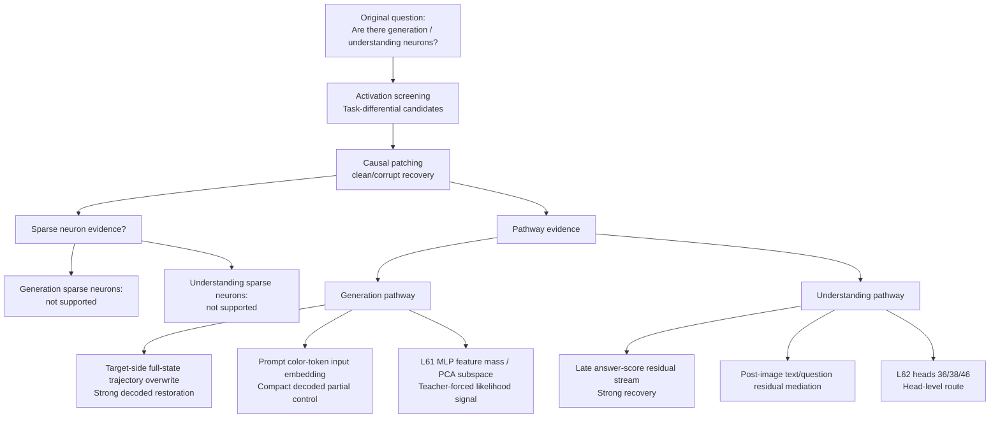
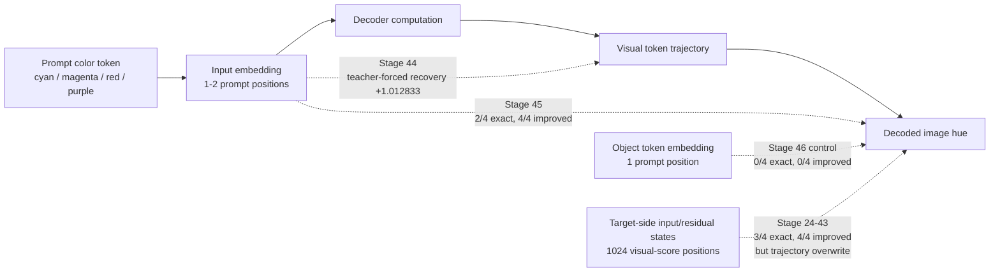
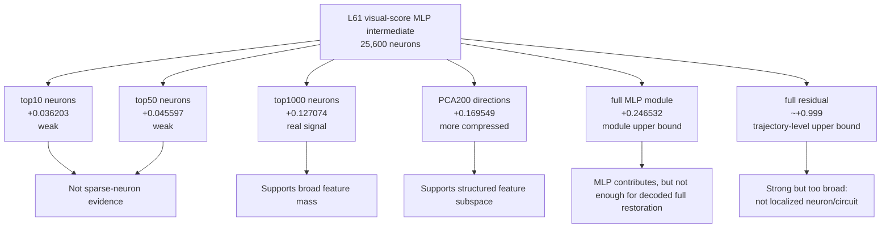
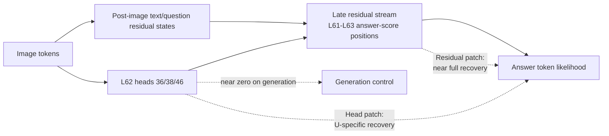
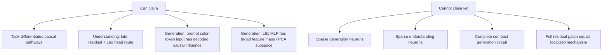
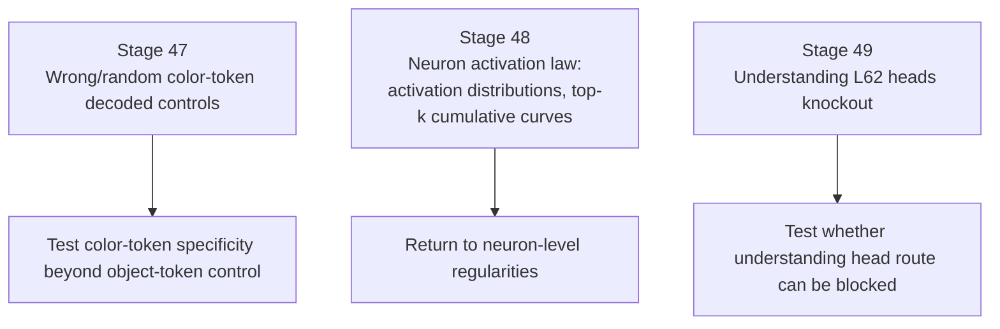

# Emu3.5 Generation / Understanding Path Visualization

## 1. Current Evidence Map

## 2. Generation: What We Have Actually Found

## 3. Generation: Neuron / Feature Interpretation

## 4. Understanding Pathway

## 5. Claim Boundary

## 6. Next Experiments

